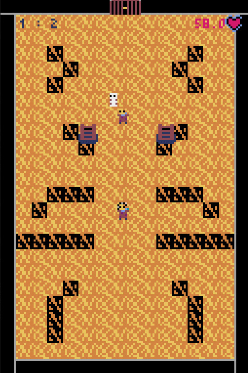

<h1 align="center">Nuit du code <a href="https://www.nuitducode.net/ndc2023/T">2023</a></h1>


<p align="center">
  
  
  
  <br>
  
  
</p>


```
Dans ce jeu, l'objectif est d'atteindre le plus haut niveau possible.
Pour ce faire, il faut tuer tout les ennemis de chaque niveau sans se faire tuer.
Vous pouvez vous déplacer en utilisant les flèches du clavier et tirez automatiquement lorsque vous êtes arrêté.
La difficultée augmente au fur et à mesure que vous progressez tous les 5 niveaux. 
 ```
 
 <p align="center">big up à <a href= "https://github.com/Zwarex">LOSCRAKOS</a></p>

 
